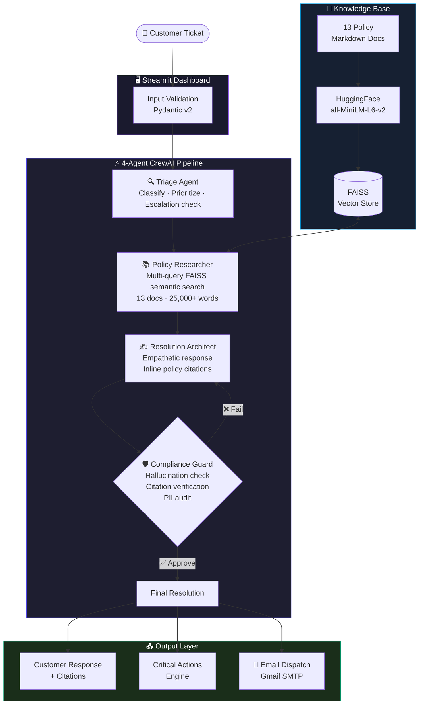
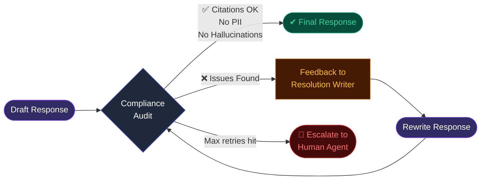

<div align="center">

<!-- Animated SVG Banner -->
<svg width="900" height="200" viewBox="0 0 900 200" xmlns="http://www.w3.org/2000/svg">
  <defs>
    <linearGradient id="bg" x1="0%" y1="0%" x2="100%" y2="100%">
      <stop offset="0%" style="stop-color:#0f0c29"/>
      <stop offset="50%" style="stop-color:#302b63"/>
      <stop offset="100%" style="stop-color:#24243e"/>
    </linearGradient>
    <linearGradient id="accent" x1="0%" y1="0%" x2="100%" y2="0%">
      <stop offset="0%" style="stop-color:#a78bfa"/>
      <stop offset="100%" style="stop-color:#22d3ee"/>
    </linearGradient>
    <filter id="glow">
      <feGaussianBlur stdDeviation="3" result="coloredBlur"/>
      <feMerge><feMergeNode in="coloredBlur"/><feMergeNode in="SourceGraphic"/></feMerge>
    </filter>
  </defs>
  <!-- Background -->
  <rect width="900" height="200" rx="16" fill="url(#bg)"/>
  <!-- Decorative circles -->
  <circle cx="780" cy="40" r="80" fill="rgba(139,92,246,0.08)"/>
  <circle cx="820" cy="160" r="50" fill="rgba(6,182,212,0.06)"/>
  <circle cx="100" cy="160" r="60" fill="rgba(99,102,241,0.07)"/>
  <!-- Grid lines -->
  <line x1="0" y1="100" x2="900" y2="100" stroke="rgba(255,255,255,0.03)" stroke-width="1"/>
  <line x1="450" y1="0" x2="450" y2="200" stroke="rgba(255,255,255,0.03)" stroke-width="1"/>
  <!-- Accent bar -->
  <rect x="60" y="60" width="4" height="80" rx="2" fill="url(#accent)"/>
  <!-- Title text -->
  <text x="84" y="105" font-family="'SF Pro Display', -apple-system, sans-serif" font-size="36" font-weight="900" fill="white" filter="url(#glow)">ResolveAI</text>
  <!-- Subtitle -->
  <text x="84" y="132" font-family="'SF Pro Display', -apple-system, sans-serif" font-size="14" fill="rgba(255,255,255,0.45)">4-Agent RAG Pipeline  ·  Gemini 3.1 Flash Lite  ·  Zero-Hallucination Guardrails</text>
  <!-- Badge row -->
  <rect x="84" y="148" width="90" height="22" rx="11" fill="rgba(139,92,246,0.2)" stroke="rgba(139,92,246,0.4)" stroke-width="1"/>
  <text x="129" y="163" font-family="sans-serif" font-size="11" fill="#c4b5fd" text-anchor="middle">CrewAI</text>
  <rect x="182" y="148" width="90" height="22" rx="11" fill="rgba(139,92,246,0.2)" stroke="rgba(139,92,246,0.4)" stroke-width="1"/>
  <text x="227" y="163" font-family="sans-serif" font-size="11" fill="#c4b5fd" text-anchor="middle">LangChain</text>
  <rect x="280" y="148" width="70" height="22" rx="11" fill="rgba(139,92,246,0.2)" stroke="rgba(139,92,246,0.4)" stroke-width="1"/>
  <text x="315" y="163" font-family="sans-serif" font-size="11" fill="#c4b5fd" text-anchor="middle">FAISS</text>
  <rect x="358" y="148" width="100" height="22" rx="11" fill="rgba(6,182,212,0.15)" stroke="rgba(6,182,212,0.4)" stroke-width="1"/>
  <text x="408" y="163" font-family="sans-serif" font-size="11" fill="#67e8f9" text-anchor="middle">Gemini 3.1 ⚡</text>
  <rect x="466" y="148" width="80" height="22" rx="11" fill="rgba(52,211,153,0.15)" stroke="rgba(52,211,153,0.4)" stroke-width="1"/>
  <text x="506" y="163" font-family="sans-serif" font-size="11" fill="#34d399" text-anchor="middle">Multi-Payment</text>
</svg>

<br/>

[](https://python.org)
[](https://deepmind.google/technologies/gemini/)
[](https://crewai.com)
[](https://github.com/facebookresearch/faiss)
[](https://streamlit.io)
[](LICENSE)

</div>

---

## What This Is

A production-grade, multi-agent AI system that automatically resolves e-commerce customer support tickets. Four specialized AI agents work sequentially — each with a distinct role — to produce empathetic, policy-grounded responses with zero hallucinations.

---

## UI Preview

<table>
  <tr>
    <td align="center" width="50%">
      
      <br/>
      <sub><b>🖥️ Dashboard</b> — Agent pipeline, currency toggle, system config</sub>
    </td>
    <td align="center" width="50%">
      
      <br/>
      <sub><b>✅ Resolution Output</b> — Clean metrics, cited response, policy badges</sub>
    </td>
  </tr>
</table>

---

## Architecture



---

## Compliance Loop



---

## Features

| Feature | Details |
| :--- | :--- |
| **💳 Multi-Payment** | UPI, Credit / Debit Card, and Cash on Delivery support built-in |
| **🛡️ Zero-Hallucination** | Mandatory compliance loop — every factual claim verified against source docs |
| **📎 100% Citation Rate** | All responses cite specific policy sections with document + section names |
| **📧 Email Dispatch** | Sends formatted HTML email to customer via Gmail SMTP after resolution |
| **🏆 Loyalty Tiers** | Bronze → Silver → Gold → Platinum tier-specific resolution logic |
| **⚠️ Auto Escalation** | Legal threats, fraud, and safety issues are flagged and escalated |
| **🔄 Compliance Loop** | Writer ↔ Auditor feedback cycle with `max_iter=3` hard cap |
| **⚡ Stable Architecture** | UTF-8 safe, no infinite loops, optimized for 15 RPM Gemini quota |

---

## Tech Stack

| Component | Technology | Why This Choice |
| :--- | :--- | :--- |
| **LLM** | Google Gemini 3.1 Flash Lite | Best speed/reliability balance for agentic tool-use at 15 RPM |
| **Orchestration** | CrewAI 1.x | Production-grade sequential agents with shared task memory |
| **Vector Store** | FAISS | Zero-overhead in-memory similarity search for ~200 policy chunks |
| **Embeddings** | HuggingFace all-MiniLM-L6-v2 | Local, zero-cost, high-quality semantic vectorization |
| **Data Models** | Pydantic v2 | Strict input/output validation across all agents |
| **Email** | Python smtplib + Gmail SMTP | Standard, dependency-free HTML email dispatch |
| **Interface** | Streamlit | Glassmorphism dark UI with glassmorphism cards |
| **Language** | Python 3.12 | Type-annotated, production-quality codebase |

---

## Quick Start

### 1. Install Dependencies
```bash
pip install -r requirements.txt
```

### 2. Configure Environment
```bash
copy .env.example .env
```
Edit `.env` and add:
```
GOOGLE_API_KEY=your_gemini_key_here
SUPPORT_EMAIL=your_gmail@gmail.com
SUPPORT_EMAIL_PASSWORD=your_16char_app_password
```

> **Gmail App Password**: Go to [myaccount.google.com/apppasswords](https://myaccount.google.com/apppasswords), create an App Password for "Mail", paste the 16-character code above.

### 3. Build Knowledge Base
```bash
python build_index.py
```

### 4. Launch Dashboard
```bash
streamlit run app.py
```

---

## Evaluation

```bash
# Run full 23-ticket benchmark
python tests/evaluate.py

# Quick smoke test (1 ticket)
python tests/evaluate.py --max 1
```

**March 2026 Benchmark Results:**

| Metric | Score |
| :--- | :---: |
| Citation Coverage Rate | **100%** |
| Compliance Pass Rate | **100%** |
| Error Rate | **0%** |

---

## Deliverables

| Document | Description |
| :--- | :--- |
| [**WRITEUP.md**](WRITEUP.md) | 1-page architecture + evaluation summary |
| [**EXAMPLE_RUNS.md**](EXAMPLE_RUNS.md) | 3 full documented runs: exception, escalation, abstention |
| [**evaluation_results/**](evaluation_results/) | Full benchmark report — 100% citation & compliance pass rate |

---

## Project Structure

```
AGENTIC_AI/
├── app.py                        # Streamlit dashboard (glassmorphism UI)
├── build_index.py                # FAISS index builder
├── requirements.txt
├── .env.example                  # Environment template
├── config/
│   └── settings.py               # Pydantic settings management
├── data/
│   ├── policies/                 # 13 policy markdown documents (25k+ words)
│   └── vectorstore_hf/           # Pre-built FAISS index
├── src/
│   ├── models.py                 # Pydantic data models
│   ├── orchestrator.py           # CrewAI pipeline orchestrator
│   ├── email_sender.py           # Gmail SMTP email dispatch
│   ├── agents/
│   │   ├── triage_agent.py       # Issue classification + priority
│   │   ├── retriever_agent.py    # FAISS policy search
│   │   ├── resolution_agent.py   # Response drafting
│   │   └── compliance_agent.py   # Safety audit + rewrite trigger
│   ├── ingestion/
│   │   └── document_loader.py    # Markdown chunker
│   └── vectorstore/
│       └── store.py              # FAISS wrapper
├── tests/
│   ├── test_tickets.json         # 23 pre-built test tickets
│   └── evaluate.py               # Automated evaluation harness
└── evaluation_results/           # Generated reports (post-evaluation)
```

---

## Policy Coverage

The 13 synthetic policy documents cover:

- **Returns & Refunds** — Standard returns, non-returnable categories, damaged goods
- **Shipping** — Domestic, international, express, PO box restrictions
- **Payments** — UPI, credit card, COD, refund timelines
- **Loyalty Program** — Tier benefits, points multipliers, redemption rules
- **Marketplace** — Seller vs buyer protections, fulfilled-by-platform rules
- **Fraud Prevention** — Unauthorized charges, account security, mandatory escalation
- **Warranty** — Standard + extended warranty, battery degradation, accidental damage
- **Privacy & Data** — Data retention, opt-out rights, deletion requests

---

<div align="center">

**ResolveAI — Production-Grade Multi-Agent Support Resolution · 2026**

*Gemini 3.1 Flash Lite ⚡ · CrewAI · FAISS · Streamlit*

</div>
