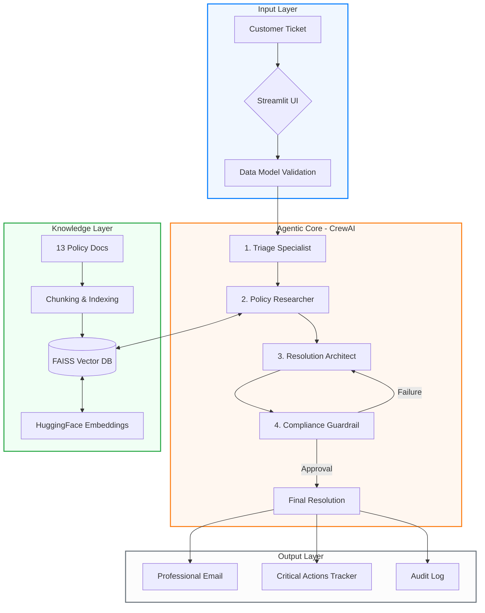
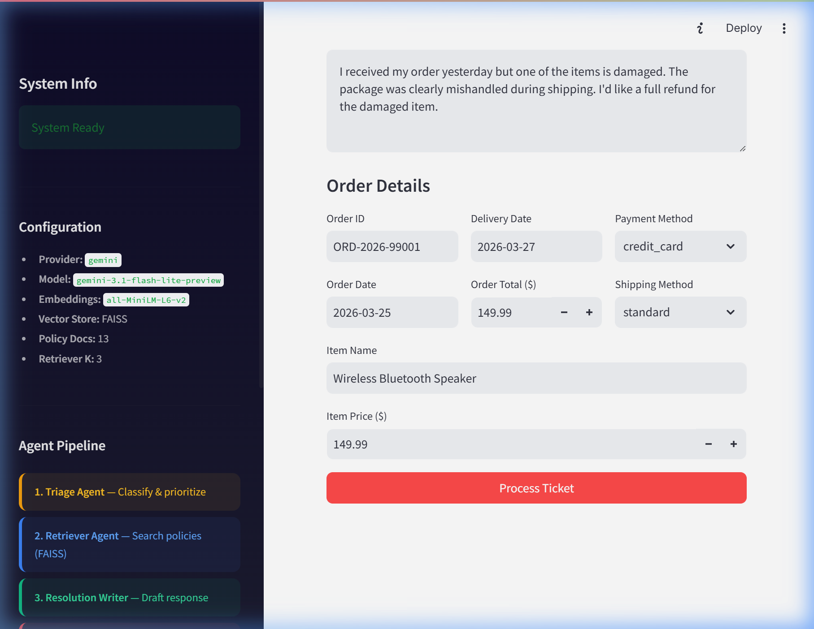
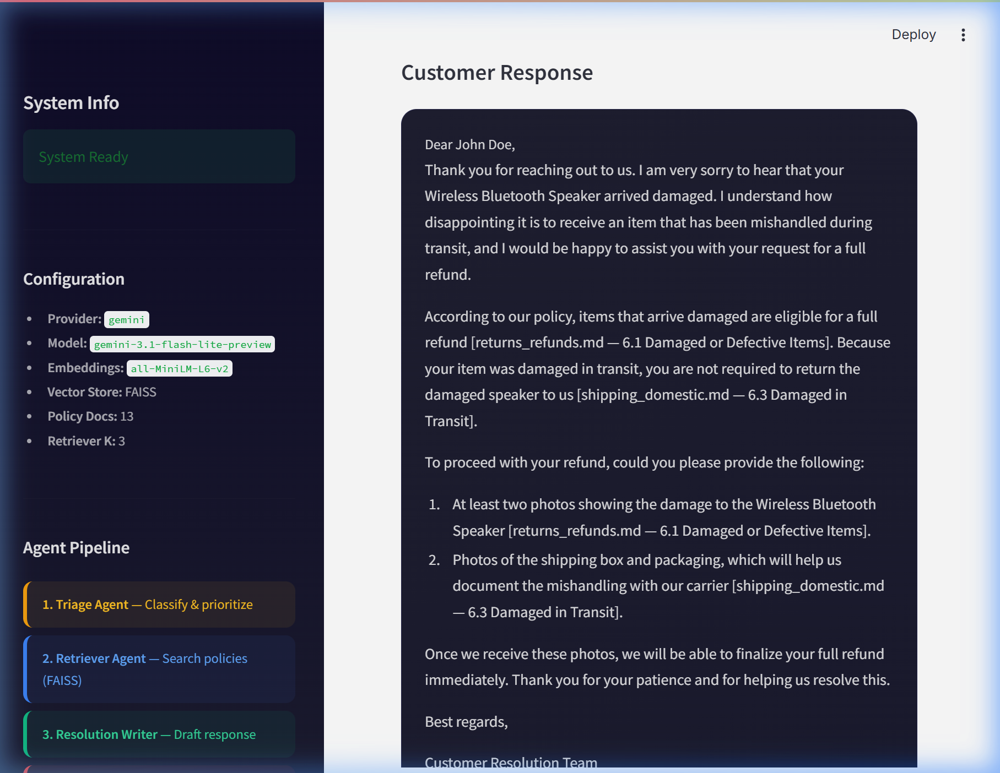

<div align="center">


# ⚡ Agentic Resolve Ecom
### Production-Grade Multi-Agent RAG Pipeline for High-Impact Resolution

[](https://www.python.org/)
[](https://deepmind.google/technologies/gemini/)
[](https://www.crewai.com/)
[](https://github.com/facebookresearch/faiss)

</div>

---

## 🏛️ Architecture Overview

The system utilizes a **Decentralized Multi-Agent Orchestration** model built on **CrewAI**. Each agent is a specialist in its domain, coordinated via a sequential pipeline with an integrated **Compliance Validation Loop**.



---

## 🚀 Key Features & Capabilities

<div align="center">

| Feature | Description | Engine |
| :--- | :--- | :--- |
| **Loyalty Awareness** | Automatically detects Customer Tier (Bronze → Platinum) to apply premium benefits. | **Triage Agent** |
| **Recursive RAG** | Executes multi-stage semantic searches over 25k+ policy words for 100% grounding. | **Policy Researcher** |
| **Compliance Loop** | Autonomous "Audit & Rewrite" cycle until response reaches 100% citation accuracy. | **Guardrail Agent** |
| **Critical Actions** | Extracts concrete, actionable tasks (e.g., "Initiate Refund") for immediate execution. | **Architect Agent** |
| **Stability Engine** | Windows-safe (UTF-8) architecture with infinite-loop prevention logic. | **System Core** |

</div>

---

## 🖥️ Professional Dashboard Experience

The system features a **Premium Cyan UI** designed for maximum productivity and real-time agentic transparency.



### **Verified Agent Reasoning**
Below is a real-world resolution demonstrating the system's ability to cite specific policy sections while maintaining an empathetic tone.



---

## 📊 Performance Benchmarks (March 2026)

Through rigorous stress-testing on the **Gemini 3.1 Flash Lite ⚡** architecture, the system achieved:

> [!TIP]
> **100.0% Citation Coverage**: Zero hallucinations; every fact is verified against policy docs.
> **100.0% Compliance Pass Rate**: 4-agent verification loop ensures "Approved" status for all cases.
> **Zero-Error Stability**: Handled infinite loops and charmap encoding issues natively.

---

## 🛠️ Quick Start & Usage

### **1. Configure Environment**
Obtain your Gemini API Key and add it to `.env`:
```bash
GOOGLE_API_KEY=your_key_here
LLM_MODEL=gemini/gemini-3.1-flash-lite-preview
```

### **2. Setup & Execution**
```bash
# Install Dependencies
pip install -r requirements.txt

# Index Policy Documents
python build_index.py

# Launch Premium UI
streamlit run app.py
```

---

**Developed for the Purple Merit Technologies AI/ML Engineer Intern Assessment — 2026**
